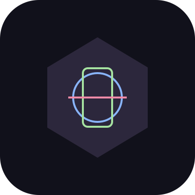

<div align="center">
  
  <h1>🤖 MultiBot</h1>
  <p><b>Telegram multi-tool bot</b> — download, QR, shortlink, sticker, cuaca, kalkulator.</p>

  <p>
    <a href="https://github.com/mocasus/multibot/releases"></a>
    <a href="LICENSE"></a>
    
    
    
  </p>

  <p>
    <a href="https://github.com/mocasus/multibot/stargazers"></a>
    <a href="https://github.com/mocasus/multibot/network/members"></a>
    <a href="https://github.com/mocasus/multibot/issues"></a>
    
    
  </p>

  <p>
    <a href="#-features"></a>
    <a href="#-quick-start"></a>
    <a href="#-commands"></a>
    <a href="#-deploy"></a>
    <a href="#-project-structure"></a>
  </p>
</div>

---

## ✨ Features

- 📥 **Video Downloader** — Download video dari Instagram, TikTok, YouTube dengan `/dl`
- 🔳 **QR Code Generator** — Generate QR code langsung di chat dengan `/qr`
- 🔗 **URL Shortener** — Pendein URL via TinyURL / is.gd dengan `/short`
- 🖼 **Sticker Converter** — Konversi foto ↔ stiker dengan `/sticker` & `/toimg`
- 🌤 **Cek Cuaca** — Info cuaca real-time dengan `/cuaca [kota]`
- 🧮 **Kalkulator** — Hitung ekspresi matematika dengan `/calc`

---

## 🚀 Quick Start

```bash
# Clone
git clone https://github.com/mocasus/multibot.git
cd multibot

# Setup venv + install
python3 -m venv venv
./venv/bin/pip install -r requirements.txt

# Konfigurasi
cp .env .env.local
# Edit .env.local — isi BOT_TOKEN dari BotFather

# Jalankan
./venv/bin/python3 bot.py
```

---

## 📋 Commands

| Command | Fungsi | Contoh |
|---------|--------|--------|
| `/start` | Info bot & welcome | `/start` |
| `/help` | List semua command | `/help` |
| `/dl [url]` | Download video | `/dl https://instagram.com/p/...` |
| `/qr [teks]` | Generate QR code | `/qr https://github.com` |
| `/short [url]` | Shorten URL | `/short https://example.com/very/long` |
| `/sticker` | Foto → Stiker (reply foto) | Reply foto + `/sticker` |
| `/toimg` | Stiker → PNG (reply stiker) | Reply stiker + `/toimg` |
| `/cuaca [kota]` | Cek cuaca | `/cuaca Jakarta` |
| `/calc [ekspr]` | Kalkulator | `/calc sqrt(144) + 2^3` |

---

## 🖥 Deploy

### systemd (Linux VPS)

```bash
sudo cp multibot.service /etc/systemd/system/
sudo systemctl daemon-reload
sudo systemctl enable --now multibot
sudo systemctl status multibot
```

### Docker

```bash
docker build -t multibot .
docker run -d --env-file .env --name multibot multibot
```

---

## ⚙️ Konfigurasi

Edit `.env`:

| Variable | Required | Deskripsi |
|----------|----------|-----------|
| `BOT_TOKEN` | ✅ | Token dari [@BotFather](https://t.me/BotFather) |
| `WEATHER_API_KEY` | ❌ | API key [OpenWeatherMap](https://openweathermap.org/api) (untuk `/cuaca`) |
| `ADMIN_IDS` | ❌ | Telegram user ID admin (pisah koma) |

---

## 📁 Project Structure

```
multibot/
├── bot.py                  # Entry point
├── config.py               # Env loader
├── requirements.txt        # Dependencies
├── .env                    # Konfigurasi (gitignored)
├── multibot.service        # systemd unit file
└── handlers/
    ├── start.py            # /start, /help
    ├── download.py         # /dl — video downloader
    ├── qr.py               # /qr — QR generator
    ├── shorten.py          # /short — URL shortener
    ├── sticker.py          # /sticker, /toimg
    ├── weather.py          # /cuaca — weather
    └── calc.py             # /calc — calculator
```

---

## 🛠 Tech Stack

<p align="center">
  
  
  
  
  
</p>

---

## 🎨 Logo Gallery

<table align="center">
  <tr>
    <td align="center"><br><b>Robot</b><br><code>logo-v1-robot</code></td>
    <td align="center"><br><b>Abstract</b><br><code>logo-v2-abstract</code></td>
    <td align="center"><br><b>Monogram</b><br><code>logo-v3-monogram</code></td>
  </tr>
</table>

> 💡 Mau ganti logo? Generate pake AI prompt — rekomendasi: *"flat vector robot icon, two-tone dark purple + blue, clean geometric shapes, Catppuccin mocha palette, no gradients —Midjourney"*

---

<div align="center">
  <sub>v1.0 · 2026 · Built by <a href="https://github.com/mocasus">@mocasus</a></sub>
</div>
